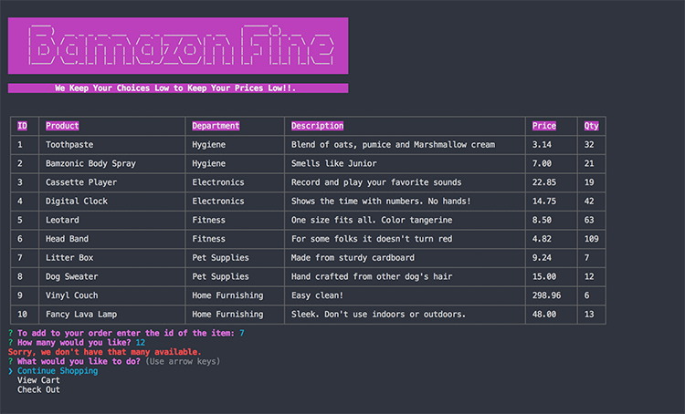
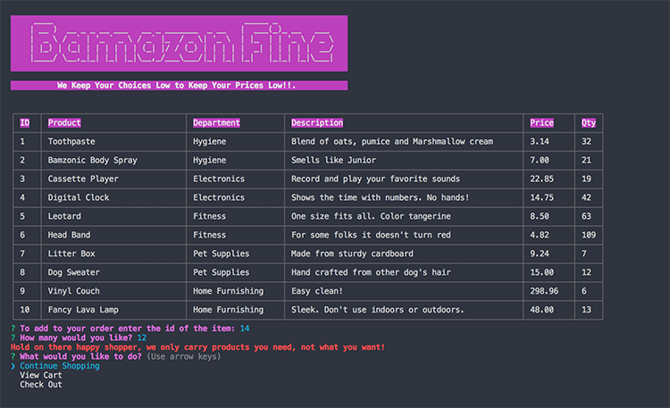
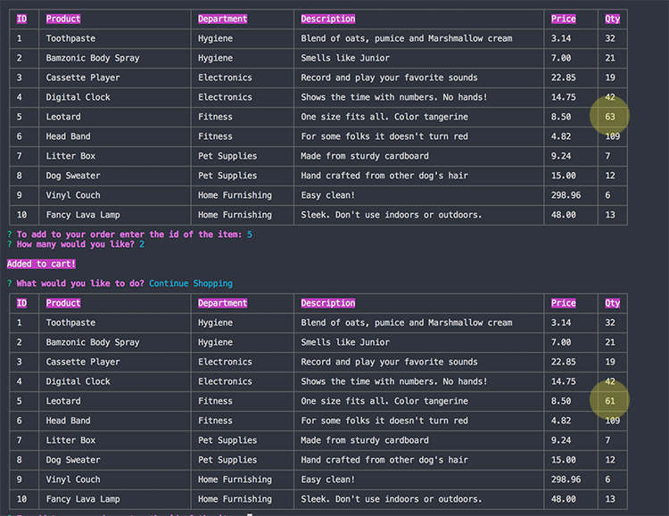

# Node.js-MySQL
Amazon-like storefront with Node.js and MySQL using CLI
<table>
<tr>
<td>
  A command line interface based on a retail web apps. Using node packages for the layout and controlling the interaction. The customer can view the cart, add products and purchase. Validations in place so the customer can't purchase items over the quantity that is in current inventory. Also checking that the item being added to the cart is a item available from the store. Not allowing the item in if it doesn't exist in the database. When a customer adds a product to the cart it also changes the inventory stored in the database.
</td>
</tr>
</table>

## Video Link
Here is a video link to the working project. :  https://iharsh234.github.io/WebApp/

## Application

### GUI
The view when the app is loaded.

### Validations
View if customer tries to purchase more than the inventory in the database.

If the customer enters a product not in the database.

### Database Updating
As the customer adds to the cart, inventory in the database changes as well.

## Packages used
- chalk
- cli-table
- colors
- figlet
- inquirer
- mysql

## Installation

### Clone

- Clone this repo to your local machine using `https://github.com/becoskie/Node.js-MySQL.git`

## Built with 

- [npm](https://www.npmjs.com/) - npm package manager for JavaScript. Build amazing things.
- [mysql](https://www.mysql.com/) - The world's most popular open source database.

### If for some odd reason... 
Helps to move the gears.thx.

<link href="https://fonts.googleapis.com/css?family=Cookie" rel="stylesheet"><a class="bmc-button" target="_blank" href="https://www.buymeacoffee.com/mwFGJN9bZ">Buy me a coffee</a>
