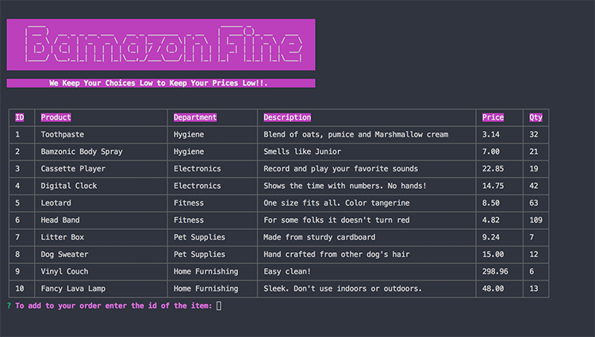

# Node.js-MySQL
Amazon-like storefront with Node.js and MySQL using CLI
<table>
<tr>
<td>
  A command line interface based on a retail web apps. Using node packages for the layout and controlling the interaction. The customer can view the cart, add products and purchase. Validations in place so the customer can't purchase items over the quantity that is in current inventory. Also checking that the item being added to the cart is a item available from the store. Not allowing the item in if it doesn't exist in the database.
</td>
</tr>
</table>

## Video Link
Here is a video link to the working project. :  https://iharsh234.github.io/WebApp/

## Application

### GUI
The view when the app is loaded.

